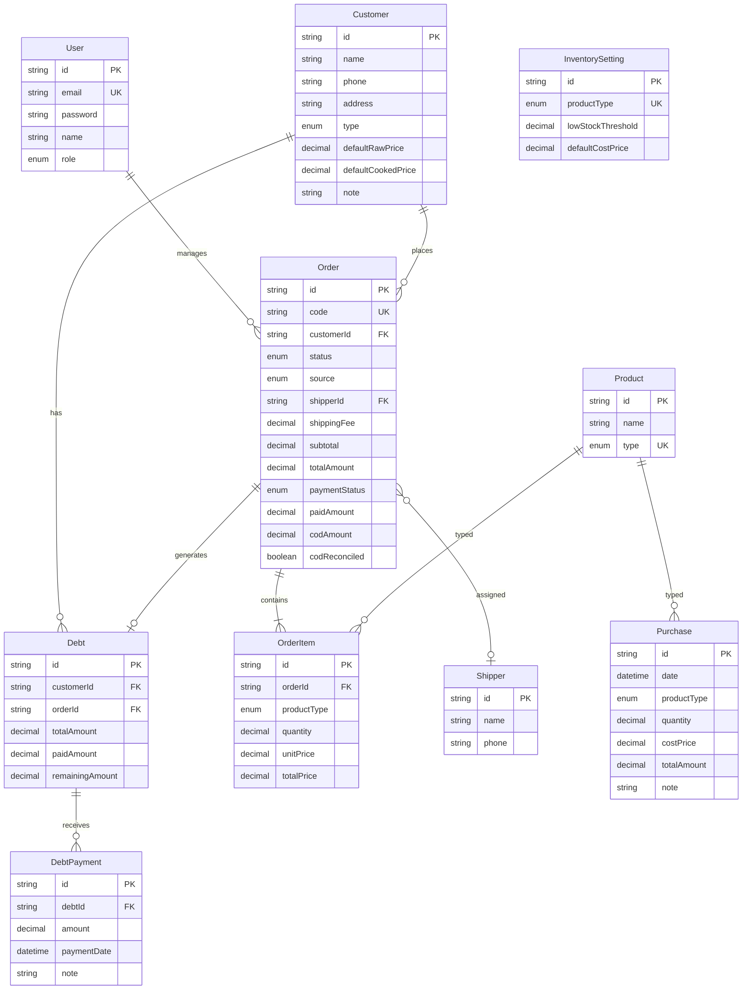

# Phân tích nghiệp vụ & ERD

## 1. Mô hình kinh doanh

```
Nhà cung cấp (anh 2) ──[nhập hàng, giá vốn cố định]──► Kho
                                                          │
                                                          ▼
                                              Khách hàng (Lẻ/Sỉ)
                                              [giá bán khác nhau]
                                                          │
                                                          ▼
                                              Đơn hàng → Ship → Giao hàng
                                                          │
                                                          ▼
                                              Thanh toán / Công nợ
```

### Luồng nghiệp vụ chính

1. **Nhập hàng**: Mua chả sống/chín từ nhà cung cấp → ghi nhận số kg, giá vốn/kg → tự tính tổng tiền → cộng tồn kho
2. **Tạo đơn**: Chọn khách → thêm sản phẩm (kg, đơn giá) → tự tính tổng → chọn thanh toán ngay/công nợ
3. **Giao hàng**: Gán shipper, COD → cập nhật trạng thái → in phiếu giao
4. **Công nợ**: Tự tạo khi đơn chưa thanh toán đủ → ghi nhận thu nợ từng phần
5. **Tồn kho**: `Tồn = Tổng nhập - Tổng bán` (đơn không hủy)

## 2. ERD



## 3. Quy tắc tính toán

| Chỉ tiêu | Công thức |
|----------|-----------|
| Tổng tiền nhập | `quantity × costPrice` |
| Tồn kho | `SUM(nhập) - SUM(bán)` theo loại SP |
| Giá trị tồn | `tồn kho × giá vốn mặc định` |
| Tổng đơn hàng | `SUM(items) + phí ship` |
| Còn nợ | `tổng đơn - đã thanh toán` |
| Lợi nhuận | `doanh thu - (kg bán × giá vốn)` |

## 4. Trạng thái & Enum

- **OrderStatus**: PENDING → SHIPPING → DELIVERED | CANCELLED
- **PaymentStatus**: PAID | DEBT | PARTIAL
- **CustomerType**: RETAIL (Lẻ) | WHOLESALE (Sỉ)
- **ProductType**: RAW (Chả sống) | COOKED (Chả chín)
- **CustomerSource**: FACEBOOK | TIKTOK | ZALO | WEBSITE | REFERRAL | OTHER
